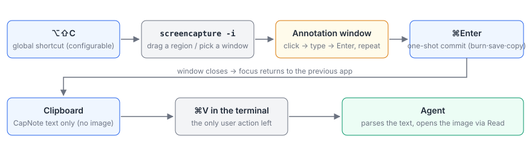
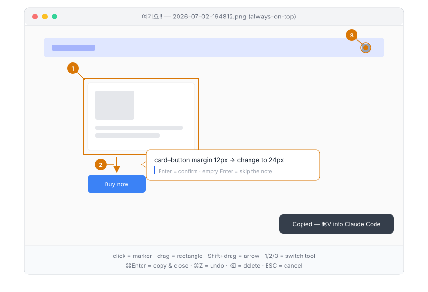
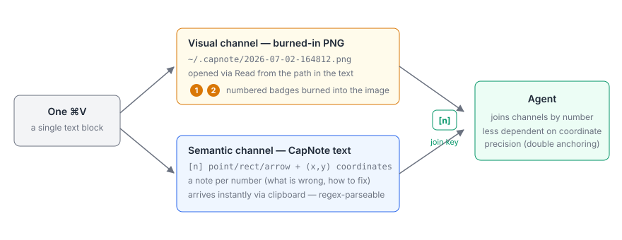
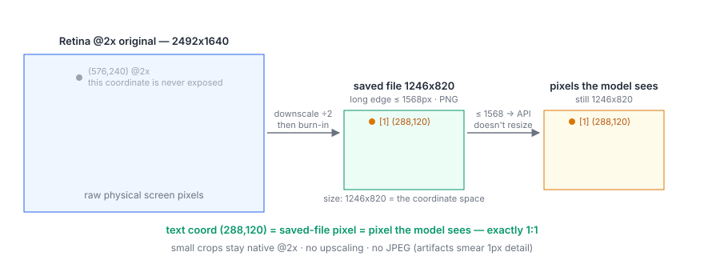
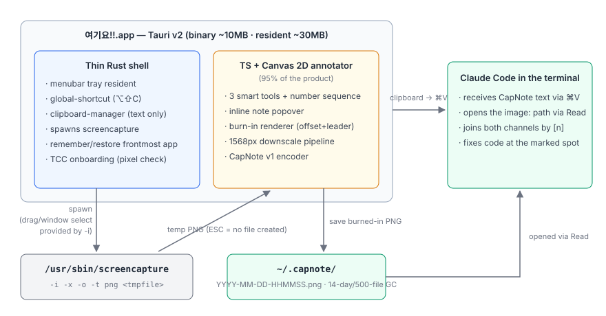

# Yeogiyo!! (여기요!!)

**English** | [한국어](README.ko.md)

A macOS screenshot capture + annotation tool that delivers visual feedback to AI coding agents — precisely.

*Yeogiyo!!* (여기요!!) is Korean for calling out **"over HERE!!"** — the feeling of pointing a finger at the screen: *"the fix goes right here!!"* (formerly *Capture for Agents*)

> **Status: ✅ Phase 3 complete (2026-07-03) — distributable build.** The full loop (capture → annotate → ⌘V) is verified end-to-end on a real device, including history, settings, and a release DMG (ad-hoc signed). Notarization (no Apple Developer account yet) is the only deferred item; multi-monitor coordinates are field-verified on an external 4K display. The detailed work plan lives in [docs/plan.html](docs/plan.html) (Korean).

---

## Why

You implemented a Figma design with Claude Code, and the result is subtly off: a card is missing its 1px border, a margin that should be 24px is 12px, an icon renders one size too small.

How do you tell the agent?

- Throw a raw screenshot at it and the agent doesn't know **where** you mean. It can tell something is wrong somewhere, but pinpointing *which card, which edge* from coordinate intuition alone is unreliable.
- Describe it in words only, and you're writing paragraphs to disambiguate "the card border is missing."

Visual information and semantic information travel separately — that's the problem.

Yeogiyo!! solves it with **numbered labels + notes + a dual channel**:

- Drop numbered markers, rectangles, and arrows onto the captured image (visual channel),
- attach a free-text note to each number (semantic channel),
- and put a single **CapNote v1** text block on the clipboard that joins both channels by number.

The agent reads the image path from the text, opens the file directly, and matches the burned-in numbers `[1] [2] [3]` against the coordinates + notes in the text. "Exactly where, exactly what to fix" arrives in one ⌘V.

## How it works

1. **⌥⇧C** — global shortcut starts a capture (menubar-resident, no cold start; shortcut is configurable).
2. **Drag to select a region** — or press Space for window mode, ESC to cancel (native macOS `screencapture` UI).
3. **Click/drag to label + note** — in the annotation window that opens right after capture: click = numbered marker, drag = rectangle, Shift+drag = arrow. The inline note input focuses immediately; type → Enter.
4. **⌘Enter** — one-shot commit: burn-in render → downscale to ≤1568px → save PNG → copy the CapNote text block → window closes and focus returns to your previous app.
5. **⌘V in the terminal** — paste into Claude Code. Done.

Target feel: ~5 seconds for a one-marker feedback, ~10 seconds for three.





## CapNote v1

What lands on the clipboard is a single plain-text block:

```capnote v1
image: /Users/jin/.capnote/2026-07-02-164812.png
size: 1246x820
scale: 1 image px = 1 CSS px
source: region capture @2x, downscaled 1/2 (2026-07-02 16:48)
context: Card component details missing vs. the Figma design (3 items)
[1] rect (288,120)-(456,214) "product card"
    The card is missing its 1px solid #E5E7EB border. Present in Figma, absent in the build.
[2] arrow (524,412)->(524,468) "card → save button"
    The margin between the card and the button below is 24px in the design but 12px here. Change to 24px.
[3] point (1108,96) "header settings icon"
    This icon should be 20x20 per the design but renders at 16x16.
hint: Read the image file at the path above. Numbered badges matching [n] are burned into the image. Coordinates are image pixels (origin top-left); px values in notes are CSS px.
```



### Grammar summary

| Element | Form | Notes |
| --- | --- | --- |
| Header | `image:` absolute PNG path / `size:` WxH / `scale:` px ratio / `source:` capture meta (optional) / `context:` one-line summary (optional) | `size` **is** the coordinate space; `scale` is always 1:1 under the standard downscale policy |
| Marker | `[n] point (x,y)` | numbered point marker |
| Rectangle | `[n] rect (x1,y1)-(x2,y2)` | |
| Arrow | `[n] arrow (x1,y1)->(x2,y2)` | tail → head |
| Label | `"…"` after coordinates (optional) | visible text of the target element; backward compatible when absent |
| Note | next line(s), indented 4 spaces | free text, multiline, optional |
| hint | last line, one agent instruction (English) | |

Machine-parseable with a single regex, readable as-is by humans, and usable by vision-less models from coordinates + notes alone.

### Why the clipboard is text-only

In Claude Code on macOS, pasting an *image* is Ctrl+V, not ⌘V — a habit trap where the image silently vanishes. And an image alone carries no semantics. Instead, the burned-in PNG is saved to a file and its absolute path is embedded in the text: the agent reads the image itself with its Read tool. One ⌘V delivers the visual channel and the semantic channel simultaneously.

## Core design invariants

1. **The clipboard is text-only.** Images are saved as files with their absolute path embedded in the text — the agent reads them directly.
2. **Exactly one coordinate space** — the pixels of the saved final image (origin top-left). The `size` header declares the space; original Retina coordinates are never exposed.
3. **PNG with long edge ≤ 1568px.** Below the Anthropic vision API resize threshold, so the pixels the model sees map 1:1 to the text's coordinate space. Retina @2x is halved; small crops stay native. No JPEG, no upscaling.
4. **Burn-in is mandatory, rendered at final resolution after downscaling.** Number badges sit 8–12px off-target with a leader line; rects are dashed with a 2px outset; points are rings — so annotations are never mistaken for real UI. Note text is never burned in (that's the text channel's job).
5. **Markers, rectangles, and arrows share one auto-incrementing number sequence.** The number is the join key between the two channels — double anchoring that doesn't depend on the agent's coordinate-reading precision.



## Roadmap

| Phase | Goal | Est. active-days |
| --- | --- | --- |
| 0 | ✅ **Done (2026-07-02)** Format validation spike — E2E with 6 blind agents (9/9 marker identification), spec frozen. [Report](docs/phase0-verification.md) (Korean) | 0.5d |
| 1 | ✅ **Done (2026-07-02)** Working skeleton — Tauri v2 menubar app, global shortcut, screencapture wrapper, path-only clipboard, focus restore, TCC onboarding | 1–2d |
| 2 | ✅ **Done (2026-07-02)** Annotation + CapNote — smart tools with a single number sequence, inline notes, burn-in renderer, 1568px downscale pipeline, encoder, file GC. [Report](docs/phase2-verification.md) (Korean) | 2–3d |
| 3 | ✅ **Done (2026-07-03)** Polish & hardening — window-show speed, keyboard-only flow, 10-entry history (re-copy/re-annotate), badge collision avoidance, single instance, settings, 3-terminal paste tests, 4K multi-monitor coordinate check, agent accuracy eval, release DMG (ad-hoc). [Report](docs/phase3-verification.md) (Korean) | 2–3d |
| 4 | Backlog — history palette, capnote CLI / MCP server mode, cross-platform (only if demand proves out) | — |

## Development

- **Stack**: Tauri v2 menubar-resident app. The annotation UI (95% of the product) is TypeScript + Canvas 2D; Rust is a thin shell (official global-shortcut / clipboard-manager plugins + a few dozen lines spawning `screencapture`).
- **Capture**: spawns `/usr/sbin/screencapture -i -x -o -t png <tmpfile>` — drag selection, window mode, and ESC cancel come for free, no custom overlay.
- **Storage**: `~/.capnote/YYYY-MM-DD-HHMMSS.png` (configurable), auto-GC after 14 days or beyond 500 files (configurable).
- **Permissions**: one-time TCC "Screen Recording" approval. Onboarding verifies actual pixels of a test capture. In dev mode the permission attaches to your terminal/IDE, not the app.
- **Footprint**: ~10MB binary, ~30MB resident memory, no cold start.



Build & run: `pnpm install`, then `pnpm tauri dev` (development) / `pnpm tauri build` (release bundle). Verification: `pnpm check` (tsc) · `pnpm lint` (eslint) · `cargo check` in `src-tauri/`.

See [CONTRIBUTING.md](CONTRIBUTING.md) for the contribution workflow and the rules that keep the frozen spec intact.

## License

[MIT](LICENSE)
